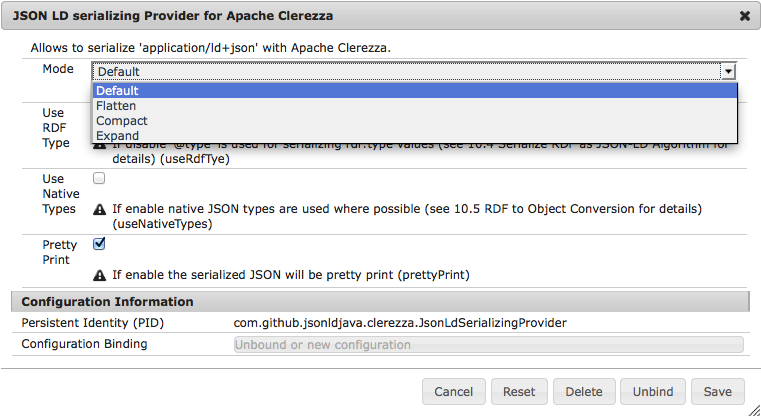

Note: this is the documentation for the current unstable development branch. [For the stable release documentation see here](https://github.com/jsonld-java/jsonld-java/blob/v0.3/integration/clerezza/README.md)

JSONLD-Java Clerezza Integration module
=======================================

This module provide a `ParsingProvider`and `SerializingProvider` for Apache Clerezza. Those Providers plug into the Clerezza `Parser` and `Serializer` service infrastructure. Meaning that adding this bundle will allow Clerezza to parse and serialize JSON-LD.

USAGE
=====

Maven Dependency
----------------

    <dependency>
        <groupId>com.github.jsonld-java</groupId>
        <artifactId>jsonld-java-clerezza</artifactId>
        <version>0.6.1-SNAPSHOT</version>
    </dependency>

(Adjust for most recent <version>, as found in ``pom.xml``).

From OSGI
---------

Assuming the above Bundle is active in the OSGI Environment one can simple inject the `Serializer` and/or `Parser` service.

    @Reference
    private Serializer serializer;

    @Reference
    private Parser parser;

Normal Java
-----------

Both the `Parser` and `Serializer` also support `java.util.ServiceLoader`. So when running outside an OSGI environment one can use the `getInstance()` to obtain an instance.

    Serializer serializer = Serializer.getInstance();

    Parser parser = Parser.getInstance();

Supported Formats
-----------------

The JSON-LD parser implementation supports `application/ld+json`. The serializer supports both `application/ld+json` and `application/json`.

The rational behind this is that the parser can not parse any JSON however the Serializer does generate valid JSON.

Serializer Configuration
------------------------

__NOTES:__ OSGI only, single global configuration only.

The Serializer can be configured by using the following options:

* `useRdfTye`: If disable '@type' is used for serializing rdf:type values \
(see 10.4 Serialize RDF as JSON-LD [Algorithm](http://www.w3.org/TR/json-ld-api/#algorithm-16) for details)
* `useNativeTypes`: If enable native JSON types are used where possible (\
see 10.5 RDF to [Object Conversion](http://www.w3.org/TR/json-ld-api/#rdf-to-object-conversion) for details)
* `mode`: Allows to set the serialization mode
    * `none`: The default as used by java-jsonld
    * `expand`: Expands the serialized RDF according to the steps in the [Expansion algorithm](http://www.w3.org/TR/json-ld-api/#expansion-algorithm).
    * `flatten`: Fattens the serialized RDF according to the steps in the [Flattening algorithm](http://www.w3.org/TR/json-ld-api/#flattening-algorithm)
    * `compact`: Compacts the serialized RDF using the context according to the steps in the [Compaction algorithm](http://www.w3.org/TR/json-ld-api/#compaction-algorithm).
* `prettyPrint`: If enabled the serialized RDF will be pretty print

Clerezza does only allow for a single Serializer and also does not support parsing a configuration when serializing a RDF graph. That means that the configuration will be global and be used for all RDF graphs to be serialized.
